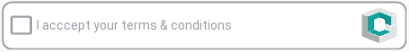

 logo](img/consentame_logo.png)

# consenta-android
**Android plugin for [consenta.me](https://consenta.me).** Created May 2018 by Andrea Arighi <[andrea@chino.io](mailto:andrea@chino.io)>

Consenta.me is a [Chino.io](https://chino.io) product, created with all the experience on GDPR
and creation of health applications.

## How to use

### Create a Consent
Consenta.me provides easy and GDPR/HIPAA-compliant consent tracking for web sites and apps.
Subscribe to the newsletter on [consenta.me](https://consenta.me) in order to get early access to the service.

The Consenta.me console provides an admin interface to create a Consent, specifying *Purposes*
and *Data Controllers* in an easy way. Once created, the Consent will be identified by a **Consent ID**.

### Install the Android library
*Instructions below are for* ***Android Studio 3.x*** *and* ***Android Gradle plugin 3.*** *The minimum supported SDK version is* **API 22 (Android 5.1)**

You can get the Consenta.me Android plugin via [jitpack](jitpack.io).

You need to edit your app's `build.gradle` file; add the maven repository URL:

```
allprojects {
		repositories {
			// other repositories . . .
			maven { url 'https://jitpack.io' }
		}
	}
```

and the dependency:

```
dependencies {
    // other dependencies . . . 
    implementation 'com.github.jitpack:android-example:1.0.1'
}
```


### Insert Consent button
You can now insert the `ConsentaMeCheckButton` in your Activities:

1. Import the `http://schemas.android.com/apk/res-auto` namespace in the Activity's Layout:
```XML
<LinearLayout xmlns:android="http://schemas.android.com/apk/res/android"
    xmlns:app="http://schemas.android.com/apk/res-auto"
    android:layout_width="match_parent"
    android:layout_height="wrap_content"
    android:id="@+id/enclosing_layout">

    <!-- Your content -->

 </LinearLayout>
```

2. Add the `ConsentaMeCheckButton` as if it were a normal View:
```XML
<LinearLayout xmlns:android="http://schemas.android.com/apk/res/android"
    xmlns:app="http://schemas.android.com/apk/res-auto"
    android:id="@+id/enclosing_layout"
    . . . >
    <!-- Your content -->

    <me.consenta.android.consentame.ConsentaMeCheckButton
            android:layout_width="match_parent"
            android:layout_height="wrap_content"
            />

    <!-- Your content -->
 </LinearLayout>
```

3. Add the attribute `consentId` and paste the ID of the Consent you created on Consenta.me:
```XML
<LinearLayout
        xmlns:app="http://schemas.android.com/apk/res-auto"
        . . .>

    <!-- Your content -->

    <me.consenta.android.consentame.ConsentaMeCheckButton
            android:layout_width="match_parent"
            android:layout_height="wrap_content"
            app:consentId="112a00df-1a14-2d04-3c0c-1078dbeb54a0"
            />

    <!-- Your content -->
 </LinearLayout>
```

4. While in development you can use developer API to test your app. You just have to set the attribute `dev` to `"true"`
(Remember to remove the attribute before deploying):
```XML
    <me.consenta.android.consentame.ConsentaMeCheckButton
            android:layout_width="match_parent"
            android:layout_height="wrap_content"
            app:consentId="112a00df-1a14-2d04-3c0c-1078dbeb54a0"
            app:dev="true"/>
```

5. Once the button is set, you can pass it to the class `ConsentaMe`, which provides a simple interface to get information about the status of the button.
    You can create one with
    * `public String getConsentId()`: returns the Consent ID that was set in the `consentId` XML attribute during step 3.
    * `public boolean isChecked()`: returns `true` if the user has approved the Consent.
    * `public String getUserConsentId()`: when a user approves a Consent, a unique ID is generated that binds that user
        with the approved Consent. This ID is called the **User Consent ID** and can be retrieved with this method.
        If the user has not approved the Consent, this will return `null`.
    * `public static String getCurrentConsentId()`, `public static boolean isCurrentChecked()` and `public static String getCurrentUserConsentId()`
        works like the previous methods, but they get information from the **currently running instance** of the Consent button,
        which exists as long as a User is reading the Consent's details.
    * Finally you can use `public static boolean isRunning()` to check whether there is an active instance.

## Usage guidelines

* **You may not:**
    * Have more than one screen with Consent details running at a time. The user must approve a Consent (or exit the details screen)
    before opening another Consent.
    * Insert Views inside the button's layout (even though the `ConsentaMeCheckButton` is a `Layout`).
    * Change the code of the library and/or the behaviour of any of its classes.

* **You may:**
    * Add more than one `ConsentaMeCheckButton` in the same app / activity (as long as the user can open only one of them at a time).

* **Please do not alter the button's layout.** The required `android:layout` attributes should be set like in the example above, i.e.:
  ```XML
      android:layout_width="match_parent"
      android:layout_height="wrap_content"
  ```
  You may **not** add `android:padding` (and paddingLeft/paddingTop/... variants), since it will break the button's layout.
  You may add `android:layout_margin` though (as well as layout_marginLeft/layout_marginTop/... variants),
  as long as all of its elements are visible. This includes the checkbox, the text and the [consenta.me](https://consenta.me)
  logo, like in the image below:

  

  If you are working on very big screens (TV, tablet) or very small ones (e.g. wearables) and have troubles fitting in the button
  correctly, please contact [info@chino.io](mailto:info@chino.io) or [andrea@chino.io](mailto:andrea@chino.io) to discuss a solution.
